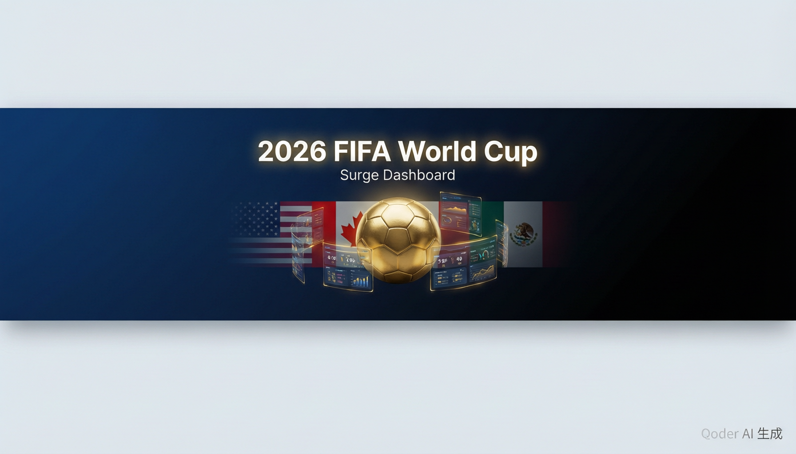

<p align="center">
  
</p>

<h1 align="center">⚽ 2026 世界杯 Surge 数据面板</h1>

<p align="center">
  <a href="https://raw.githubusercontent.com/GitHubWBB/Surge/main/fifa2026_v2/2026_WorldCup_v2.sgmodule"></a>
  <a href="https://github.com/GitHubWBB/Surge/tree/main/fifa2026_v2"></a>
</p>

<p align="center">
  FIFA 2026 美加墨世界杯 · Surge 面板模块<br>
  赛程 / 分组排名 / 进球助攻统计 / 赛事通知 · API 实时 + 静态备用双模式
</p>

---

## 📦 模块概览

本模块包含 **3 个数据面板** 和 **1 个定时通知脚本**，覆盖世界杯小组赛全部 **72 场**比赛（48 队 × 12 组 × 3 轮）。

| 组件 | 脚本 | 刷新间隔 | 功能 |
|:---:|:---:|:---:|:---|
| 🏟️ 最近赛程 | `worldcup_schedule.js` | 2 分钟 | 昨日/今日/明日比赛，API 实时比分合并 |
| 🏆 分组排名 | `worldcup_standings.js` | 5 分钟 | 12 组完整积分榜，✓ 标记出线位 |
| 📊 统计信息 | `worldcup_stats.js` | 10 分钟 | 72 人进球榜 + 50 人助攻榜（全中文） |
| 🔔 赛事通知 | `worldcup_notify.js` | 10 分钟 | 每日赛程 / 赛前提醒 / 赛后比分+进球 |

## 🔧 安装方法

### 一键安装

在 Surge 中点击以下链接，或直接复制模块地址添加到 Surge：

```
https://raw.githubusercontent.com/GitHubWBB/Surge/main/fifa2026_v2/2026_WorldCup_v2.sgmodule
```

### 可配置参数

| 参数 | 默认值 | 说明 |
|:---:|:---:|:---|
| `api_key` | 内置默认 | football-data.org API Key（可在 [官网](https://www.football-data.org/) 免费注册获取） |
| `remind_before` | `30` | 赛前提醒提前分钟数 |

---

## 🏟️ 最近赛程

> 显示昨日、今日、明日三天所有比赛，已结束比赛展示最终比分，进行中比赛展示实时比分。

```
━━━ 昨天 6月18日周三 ━━━
✅ [K组] 🇵🇹葡萄牙 1-1 🇨🇩刚果民主
✅ [L组] 🏴󠁧󠁢󠁥󠁮󠁧󠁿英格兰 4-2 🇭🇷克罗地亚
✅ [L组] 🇬🇭加纳 1-0 🇵🇦巴拿马
✅ [K组] 🇺🇿乌兹别克 1-3 🇨🇴哥伦比亚

━━━ 今天 6月19日周四 ━━━
✅ [A组] 🇨🇿捷克 1-1 🇿🇦南非
✅ [B组] [CH]瑞士 4-1 🇧🇦波黑
✅ [B组] 🇨🇦加拿大 6-0 🇶🇦卡塔尔
🚶 [A组] 09:00 🇲🇽墨西哥 vs 🇰🇷韩国

━━━ 明天 6月20日周五 ━━━
⏰ [D组] 03:00 🇺🇸美国 vs 🇦🇺澳大利亚
⏰ [C组] 06:00 🏴󠁧󠁢󠁳󠁣󠁴󠁿苏格兰 vs 🇲🇦摩洛哥
⏰ [C组] 08:30 🇧🇷巴西 vs 🇭🇹海地
⏰ [D组] 11:00 🇹🇷土耳其 vs 🇵🇾巴拉圭
```

**状态图标说明：**

| 图标 | 含义 | 显示内容 |
|:---:|:---:|:---|
| ✅ | 已结束 | 最终比分 |
| 🚶 | 进行中 | 开赛时间 + 实时比分（API 返回后显示） |
| ⏰ | 未开始 | 开赛时间 + 倒计时（3 小时内显示"X分钟后"） |

**数据来源：** 静态赛程表（72 场，北京时间）+ football-data.org API 实时比分合并。API 返回的比分自动覆盖静态数据中的预设比分。

---

## 🏆 分组排名

> 12 个小组完整积分榜（赛/胜/平/负/进/失/净/分），✓ 标记小组前两名出线位置。

```
━ A组 ━
 球队   赛 胜 平 负 进 失 净 分
✓🇲🇽墨西哥  2  2  0  0  3  0 +3  6
✓🇰🇷韩国    2  1  0  1  2  2 +0  3
 🇨🇿捷克    2  0  1  1  2  3 -1  1
 🇿🇦南非    2  0  1  1  1  3 -2  1

━ B组 ━
 球队   赛 胜 平 负 进 失 净 分
✓🇨🇦加拿大  2  1  1  0  7  1 +6  4
✓[CH]瑞士   2  1  1  0  5  2 +3  4
 🇧🇦波黑    2  0  1  1  2  5 -3  1
 🇶🇦卡塔尔  2  0  1  1  1  7 -6  1

━ I组 ━
 球队   赛 胜 平 负 进 失 净 分
✓🇳🇴挪威    1  1  0  0  4  1 +3  3
✓🇫🇷法国    1  1  0  0  3  1 +2  3
 🇸🇳塞内加尔 1  0  0  1  1  3 -2  0
 🇮🇶伊拉克  1  0  0  1  1  4 -3  0

✓ = 小组前两名出线
```

**数据来源：** football-data.org API 实时积分榜，API 失败时自动回退到内置静态备用数据（快照截至 MD2）。

---

## 📊 统计信息

> 进球榜（72 人）+ 助攻榜（50 人），所有球员名和国家名均为中文显示。

```
━━ ⚽ 进球榜 (72人) ━━
 🇦🇷阿根廷 梅西 3球
 🇨🇦加拿大 乔纳森·戴维 3球
 🇨🇦加拿大 拉林 2球
 🇺🇸美国 巴洛贡 2球
 🇩🇪德国 哈弗茨 2球
 🇸🇪瑞典 阿亚里 2球
 🇳🇿新西兰 吉斯特 2球
 🇫🇷法国 姆巴佩 2球
 🇳🇴挪威 哈兰德 2球
 🏴󠁧󠁢󠁥󠁮󠁧󠁿英格兰 凯恩 2球
 [CH]瑞士 曼赞比 2球
 🇲🇽墨西哥 基尼奥内斯 1球
 🇲🇽墨西哥 希门尼斯 1球
 🇩🇪德国 穆西亚拉 1球
 🏴󠁧󠁢󠁥󠁮󠁧󠁿英格兰 贝林厄姆 1球
 🇧🇷巴西 维尼修斯 1球
 🏴󠁧󠁢󠁥󠁮󠁧󠁿英格兰 拉什福德 1球
 ... (共72人)

━━ 🅰️ 助攻榜 (50人) ━━
 🇳🇿新西兰 克里斯·伍德 2次
 🇸🇪瑞典 伊萨克 2次
 🇩🇪德国 基米希 2次
 🇳🇱荷兰 格拉芬贝赫 2次
 🇩🇪德国 温达夫 2次
 🇭🇷克罗地亚 苏契奇 1次
 🇮🇶伊拉克 阿尔-阿马里 1次
 🇩🇪德国 维尔茨 1次
 🇰🇷韩国 李刚仁 1次
 🇫🇷法国 奥利塞 1次
 🇯🇵日本 久保建英 1次
 🇪🇬埃及 萨拉赫 1次
 🏴󠁧󠁢󠁥󠁮󠁧󠁿英格兰 萨卡 1次
 🇺🇸美国 普利希奇 1次
 ... (共50人)
```

**数据来源：**

| 榜单 | 数据源 | 模式 | 人数 |
|:---:|:---:|:---:|:---:|
| 进球榜 | [football-data.org](https://www.football-data.org/) | API 实时（`/scorers?limit=100`）| 72 人 |
| 助攻榜 | [ESPN](https://www.espn.com/soccer/stats/_/league/fifa.world/season/2026) | 静态（API 助攻覆盖不完整） | 50 人 |

所有球员均配备中文名映射（`CN_PLAYER`，90+ 条），50 个国家/地区全部中文显示。

---

## 🔔 赛事通知

> 每 10 分钟执行一次（cron），支持三种通知类型。

| 通知类型 | 触发条件 | 示例 |
|:---:|:---|:---|
| 📋 每日赛程 | 北京时间 08:00 自动推送 | `⚽ 今日赛程 · 今日4场 · [A组] 09:00 ...` |
| ⏰ 赛前提醒 | 开赛前 30 分钟（可配置） | `⚽ 即将开赛 \| A组 · ⏰ 09:00 开球 \| 约28分钟后` |
| ✅ 赛后比分 | 比赛结束后即时推送（API 模式） | `⚽ 比赛结束 \| A组 · 墨西哥 2 - 0 南非 · ⚽ Messi 23' \| David 67'` |

**通知去重机制：** 使用 Surge `$persistentStore` 存储已发送通知的 Key（`wc2026v3_notified`），已发送的通知不会重复推送，7 天自动清理过期记录。

**API 与静态模式差异：**

- API 模式：赛前提醒 + 赛后比分含进球详情（球员名+分钟数）
- 静态模式：赛前提醒 + 赛后仅提示"配置 API Key 可查看比分"

---

## 📁 文件结构

```
fifa2026_v2/
├── 2026_WorldCup_v2.sgmodule   # Surge 模块配置文件
├── worldcup_schedule.js         # 最近赛程面板（v3）
├── worldcup_standings.js        # 分组排名面板
├── worldcup_stats.js            # 统计信息面板（v6）
├── worldcup_notify.js           # 定时通知脚本（v3）
├── banner.png                   # 项目封面图
└── README.md                    # 本文件
```

## 🌐 数据来源

| 数据 | 来源 | 模式 |
|:---:|:---:|:---:|
| 赛程时间表 | 静态嵌入（72 场北京时间） | API 合并比分 |
| 实时比分 | [football-data.org](https://www.football-data.org/) | `/v4/competitions/WC/matches` |
| 分组排名 | football-data.org | `/v4/competitions/WC/standings` + 静态备用 |
| 进球榜 | football-data.org | `/v4/competitions/WC/scorers?limit=100` + 静态备用 |
| 助攻榜 | [ESPN](https://www.espn.com/soccer/stats/_/league/fifa.world/season/2026) | 静态（50 人，API 助攻覆盖不完整） |
| 赛程提醒 | 静态时间表 + API 验证 | 双模式 |
| 赛后通知 | football-data.org（含进球详情） | API 模式 |

## ⚙️ 技术说明

- **双模式架构：** 所有面板优先使用 API 获取实时数据，API 请求失败或超时（30s）时自动回退到内置静态数据
- **北京时间处理：** 所有时间存储为北京时间字符串（`YYYY-MM-DDTHH:mm`），`parseBJ()` 转 UTC Date（`Date.UTC(...) - 8*3600000`），`getBJNow()` 获取当前北京时间（`Date.now() + 8*3600000`）
- **API 名称归一化：** `API_MAP` 处理 football-data.org 返回的团队名称与内部键的差异，包含 11 条映射规则（如 `Turkey→Turkiye`、`Korea Republic→South Korea`、`Congo DR→DR Congo`、`Curaçao→Curacao`、`Czech Republic→Czechia` 等）
- **瑞士国旗：** 因 Surge 无法正确渲染 🇨🇭 emoji，全部 4 个 JS 文件统一使用 `[CH]` 文本标识
- **中文映射：** 72 位进球球员 + 50 位助攻球员全部配备中文名（`CN_PLAYER`，90+ 条），48 个国家/地区中文名完整覆盖
- **Surge API：** 面板使用 `$httpClient.get()` 获取数据、`$done()` 返回结果；通知使用 `$notification.post()` 推送、`$persistentStore` 持久化去重状态

## 📌 注意事项

- football-data.org 免费版 API 限速 10 次/分钟，建议面板刷新间隔不低于 2 分钟
- 助攻榜使用 ESPN 静态数据（football-data.org API 仅覆盖约 9 位助攻者），如需实时更新可替换 `STATIC_ASSISTS` 数组
- 小组赛阶段（6/12 - 6/29）结束后，赛程面板将显示所有已结束的近期比赛
- 进入淘汰赛后，赛程和排名面板需更新淘汰赛对阵数据（当前仅覆盖小组赛 72 场）
- 模块 `#!system=ios`，适用于 iOS 端 Surge；macOS Surge 可能需要调整配置

---

## 📝 变更说明

### v2.3 — 2026-06-19

- **统一 API_MAP 映射**：所有 4 个 JS 文件的 `API_MAP` 统一为 11 条规则，修复 `worldcup_schedule.js`（原仅 5 条）和 `worldcup_stats.js`（原仅 8 条）缺失的 Turkey、Congo DR、Korea DPR、Curaçao、Bosnia-H.、Czech Republic 等映射
- **修正模块描述**：sgmodule 描述移除已删除的"黄牌/红牌"，更新为"进球+助攻"
- **瑞士国旗标记**：全部文件统一使用 `[CH]` 替代 🇨🇭（Surge 渲染问题）

### v2.2 — 2026-06-19

- **统计信息面板重写**：完全重写 `worldcup_stats.js`，进球榜改为 API 实时获取（72 人），助攻榜改用 ESPN 数据（50 人），全部配备中文名映射
- **修复助攻数据**：football-data.org API 助攻字段仅覆盖约 9 人，改为使用 ESPN 完整 50 人静态数据
- **进球榜扩充**：静态备用数据扩充至 72 人（2 人 3 球 + 9 人 2 球 + 61 人 1 球），CN_PLAYER 中文名映射扩充至 90+ 条
- **分组排名更新**：更新 A 组静态数据（墨西哥 2 场 6 分），API_MAP 补全至 11 条

### v2.1 — 2026-06-19

- **赛程面板优化**：进行中比赛图标从 ⚡ 改为 🚶，小组名移至状态图标后方，格式 `✅ [A组] 🇲🇽墨西哥 2-0 🇿🇦南非`
- **通知脚本修复**：日期查询范围从"今天→明天"修正为"昨天→明天"，修复北京时间凌晨比赛（00:00-07:59 对应 UTC 前一天）被遗漏的问题
- **进球通知空值安全**：添加 `m.goals` 字段空值检查（`m.goals[g].scorer` 和 `m.goals[g].minute`），防止 API 未返回进球详情时报错
- **API_MAP 一致性**：standings 和 notify 文件补全 Turkey→Turkiye、Congo DR→DR Congo 等缺失映射

### v2.0 — 2026-06-18

- **初始版本发布**：完整的 2026 世界杯 Surge 数据面板模块
- **3 个数据面板**：最近赛程（昨日/今日/明日）、分组排名（12 组）、统计信息（进球+助攻）
- **1 个定时通知**：每 10 分钟执行，支持每日赛程推送（08:00）、赛前 30 分钟提醒、赛后比分通知
- **双模式架构**：所有面板优先使用 football-data.org API 实时数据，失败时自动回退静态备用数据
- **72 场小组赛覆盖**：48 队 × 12 组 × 6 场（MD1: 6/12-18, MD2: 6/19-23, MD3: 6/25-29），全部北京时间
- **中文本地化**：所有球员名、国家名均为中文显示

---

<p align="center">
  <i>Made with ❤️ for FIFA 2026 World Cup</i><br>
  <sub>USA 🇺🇸 · Canada 🇨🇦 · Mexico 🇲🇽</sub>
</p>
